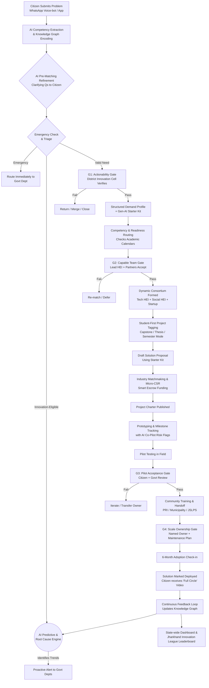

# Societal Innovation Collaboration Portal — Jharkhand (Final Merged Design)

This workflow combines a predictive/closed-loop model (technical depth, local grounding), a gated-governance model (accountability, safeguards), and a competency-hub model (structured demand signals, notification design). It is a citizen-first, locally governed operating model with predictive intelligence and a hard requirement for verified community adoption.

## Visual Workflow Diagram

## The 6 Phases of the Merged Workflow

### 1. Intake & AI Refinement (Competency Demand Signals)
Citizens submit issues via WhatsApp/Web. Instead of immediately routing to a human, the AI extracts implicit competencies needed (e.g., IoT + Social Work) and encodes them into a Knowledge Graph. **Crucially, the AI runs a Pre-Matching Refinement Loop**, asking the citizen clarifying questions to enrich the data before human review.

### 2. Triage & Predictive Intelligence
The AI splits the flow:
*   **Emergencies** (burst pipes) bypass the portal and go directly to government departments.
*   **Innovation challenges** proceed to G1.
*   **Predictive Engine (Parallel):** The AI constantly scans all incoming data against weather/satellite maps to proactively warn the government of impending regional crises (e.g., predicting a drought from scattered crop complaints).

### 3. G1: Actionability & The Gen-AI Starter Kit
A human District Innovation Officer reviews the AI-refined problem. If valid, it is converted into a "Structured Demand Profile". The system automatically attaches a **Gen-AI Starter Kit**—a summary of global patents and research papers related to the problem so students don't start from scratch.

### 4. G2: Dynamic Consortia & Readiness Routing
The system matches the problem to a **Dynamic Consortium** (e.g., Lead Engineering HEI + Supporting Social Science HEI). It routes based on a "Readiness Score," meaning the AI actively avoids assigning projects to universities during their midterm or final exam weeks. High-difficulty, long-standing problems receive an AI-assigned **"Bounty"** to attract elite student teams.

### 5. Student-First Build & AI Co-Pilot (Gamified)
Problems are explicitly tagged based on NEP 2020 criteria (e.g., "Final Year Thesis"). Students draft a proposal, secure Micro-CSR or Industry funding (held in smart escrow), and begin prototyping. 
*   **AI Co-Pilot:** Their Kanban board flags risks like upcoming monsoons or exam periods that could stall field testing.
*   **Gamification:** Students earn "Impact Points" on their dynamic Innovation Passports for passing milestones, unlocking cloud computing credits and direct industry mentorships.

### 6. G3 & G4: The Closed-Loop Community Handoff
A project is never marked "done" just because the prototype works.
*   **G3 (Pilot):** The original citizen tests the solution. 
*   **G4 (Ownership):** The student team must formally train and hand over the technology to a local body (Panchayat/JSLPS) who digitally signs a maintenance plan.
*   **The Full Circle & Ultimate Rewards:** 6 months later, if the solution is still in use:
    *   The citizens receive a thank-you video.
    *   The students receive **Blockchain-verified credentials**.
    *   The university climbs the ranks on the public **"Jharkhand Innovation League"** leaderboard.
    *   Students gain fast-tracked placement interviews with the industries that funded the solution.
